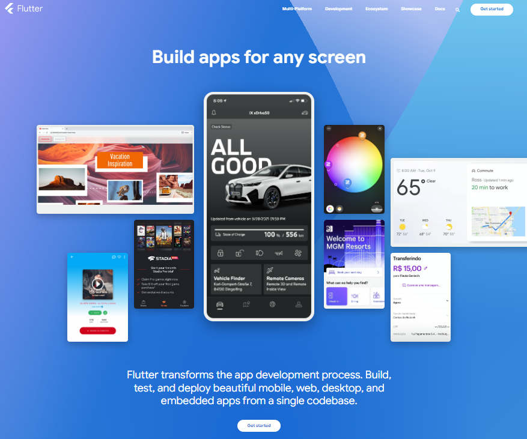
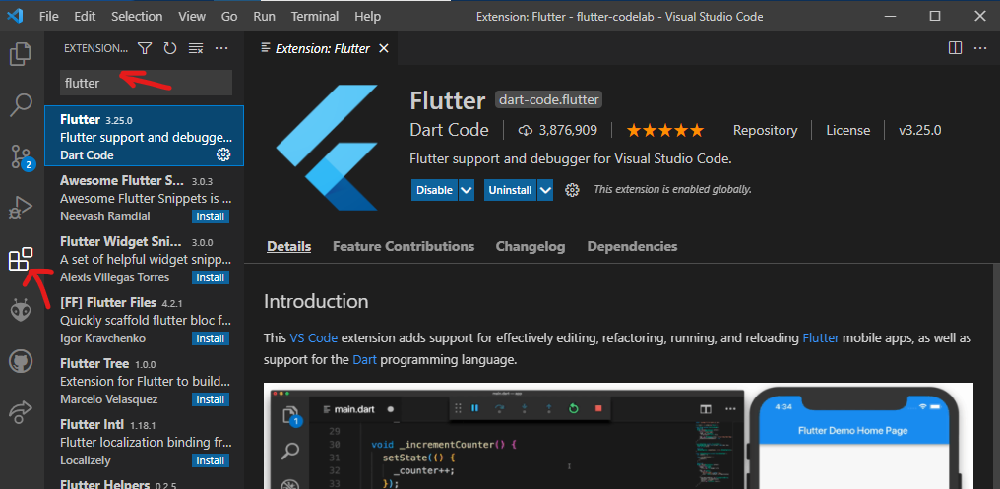
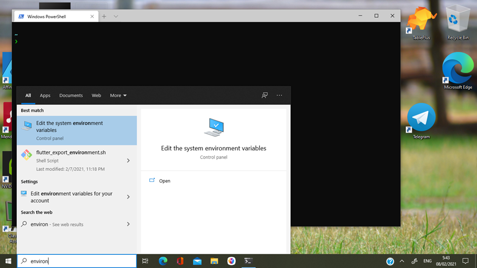
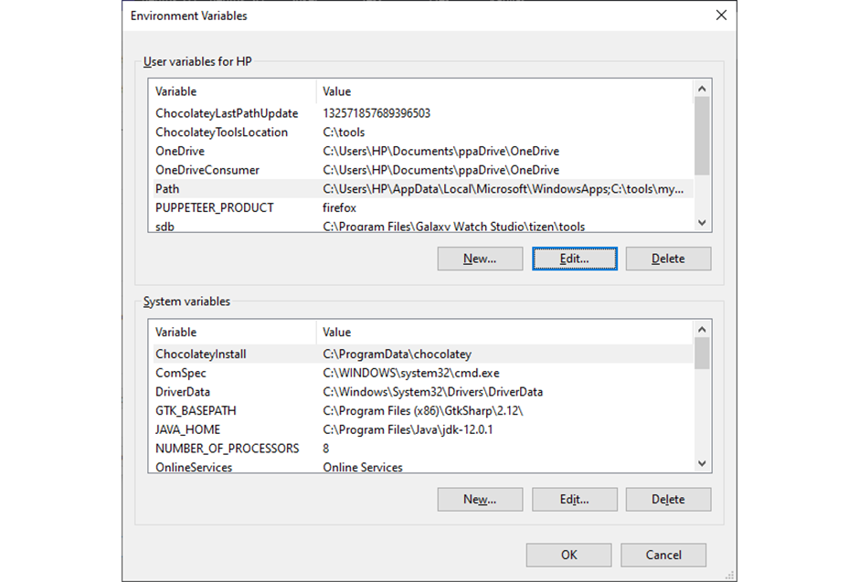
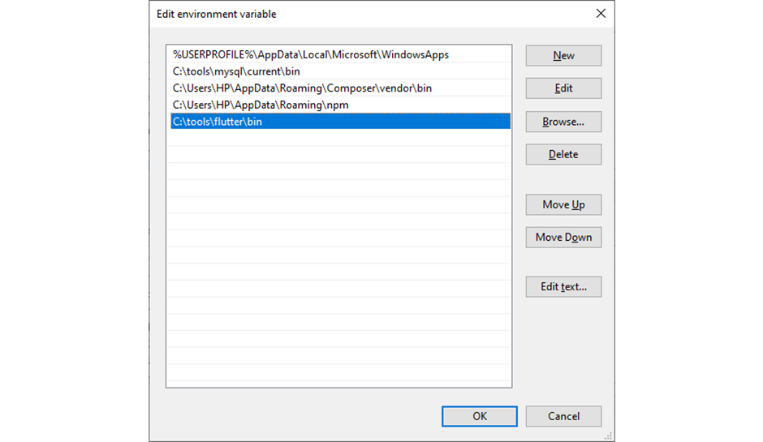

summary: Pengantar Pemrograman mobile
id: 01-pengenalan
categories: Pemrograman Mobile
tags: Pemrograman Mobile
status: Published 
authors: Achmad Afiffudin Nurzein


## Pengantar Pemrograman Mobile (Flutter)
Duration: 10 menit

**Sumber**: [https://flutter.dev/](https://flutter.dev/), **Terakhir diperbarui**: 18 Maret 2024

### Apa itu framework ?

Framework secara bahasa dalam kamus Oxford memiliki beberapa pengertian, yaitu:

[1] _the parts of a building or an object that support its weight and give it shape._

[2] _a set of beliefs, ideas or rules that is used as the basis for making judgements, decisions, etc._

Dari pengertian nomor satu menjelaskan bahwa framework adalah bagian dari sebuah bangunan atau sebuah objek yang mendukung bobot dan memberikan suatu bentuk. Pengertian dari nomor dua menjelaskan bahwa framework adalah seperangkat panutan, ide atau aturan-aturan yang digunakan sebagai dasar untuk membuat hukum, keputusan, dsb.

Framework (kerangka kerja) adalah sebuah kerangka program yang digunakan untuk membantu developer dalam mengembangkan kode secara konsisten. Adanya framework developer bisa mengurangi jumlah bug pada aplikasi yang dibuat. Karena, fungsi dan variabel yang sudah tersedia di dalam komponen framework tersebut.

Sebelum belajar lebih jauh tentang framework, ada baiknya jika Anda memahami pengertian framework terlebih dahulu. Sesuai dengan namanya, framework adalah kerangka kerja yang digunakan untuk mengembangkan aplikasi berbasis desktop atau aplikasi berbasis website.

Framework sengaja diciptakan untuk membantu developer mengembangkan aplikasi lebih cepat serta tersusun dan terstruktur. Dengan menggunakan framework Anda akan lebih mudah untuk membuat aplikasi, karena Anda hanya perlu menyusun komponen-komponen pemrograman yang sudah jadi. Sehingga developer dan programmer tidak perlu melakukan koding program yang diulang-ulang.

### Apa yang Anda akan pelajari
Di codelab ini Anda akan mempelajari tentang:

- Pengantar Pemrograman Mobile (Flutter).
- Instalasi dan konfigurasi perangkat lunak untuk pengembangan.
- Pemrograman dasar Dart

> aside positive
> Catatan: Git adalah salah satu sistem pengontrol versi (Version Control System) pada proyek perangkat lunak yang diciptakan oleh Linus Torvalds. Pengontrol versi bertugas mencatat setiap perubahan pada file proyek yang dikerjakan oleh banyak orang maupun sendiri. Git dikenal juga dengan distributed revision control (VCS terdistribusi), artinya penyimpanan database Git tidak hanya berada dalam satu tempat saja.

### Apa yang Anda perlu persiapkan
- PC atau Laptop dengan spesifikasi minimum RAM 4GB Processor Core i3
- Koneksi internet
- Chrome Browser
- Android Device atau iOS iPhone

### Pengetahuan yang Anda harus dimiliki
- Pemrograman Dasar
- Standar instalasi dan konfigurasi perangkat lunak seperti Git, Visual Studio Code (VS Code), dan Android SDK

## Pengenalan Flutter

### Apa itu Flutter?
Flutter adalah sebuah framework open source yang dibuat oleh Google. Google membuat flutter dengan tujuan membangun sebuah framework untuk membuat UI yang modern, native dan reactive yang dapat berjalan di sistem operasi iOS maupun Android. Tidak hanya pada smartphone google juga membuat flutter untuk desktop, web dan embedded device.

Flutter diprogram dengan menggunakan bahasa Dart sebuah bahasa modern yang dapat dicompile ke arsitektur processor ARM atau javascript. Flutter menggunakan Skia 2D rendering engine yang dapat bekerja pada hardware atau software yang berbeda platform.

Dart menggunakan metode compilasi ahead of time (AOT) untuk mengubah kode Dart menjadi kode native untuk sistem operasi yang digunakan, oleh karena itu aplikasi yang dibangun menggunakan flutter memiliki kecepatan yang hampir sama dengan aplikasi native. Dart juga menggunakan konsep just-in-time (JIT) sehingga memungkinkan programmer dapat membuat perubahan pada kode program dan langsung melihat hasilnya melalui fitur hot reaload yang dimiliki Flutter.

Flutter menggunakan Dart untuk membuat User Interface, sehingga memudahkan dalam membuat aplikasi karena menggunakan satu bahasa (Dart) dalam pembuatan UI maupun logika program. Flutter menggunakan pendekatan declarative dimana Flutter membangun UI mengikuti "State" yang dimiliki oleh aplikasi. Ketika state berubah maka UI akan digambar ulang.

Flutter juga memudahkan programmer karena dari satu kode program dapat dikompilasi ke kode native ARM, menggunakan GPU dan mengakses fitur spesifik dari smartphone baik yang menggunakan sistem operasi iOS ataupun yang menggunakan sistem operasi Android. Jadi dengan satu kali membuat program dapat membuat 2 aplikasi yang sama untuk sistem operasi yang berbeda (iOS atau Android).

### Widget dan Element pada Flutter
Gaya pengembangan aplikasi menggunakan flutter sedikit berbeda dengan gaya pengembangan aplikasi pada umumnya, di mana UI pada flutter dibuat menggunakan Widget. Widget adalah sebuah konsep dimana UI dapat dianggap sebagai sebuah balok LEGO, sebuah bentuk baru dapat disusun dari beberapa balok dan masing masing kumpulan balok dapat dikombinasikan dengan kumpulan balok lain sehingga membentuk sebuah bentuk baru yang lebih kompleks. Flutter menggunakan widget ini sebagai balok dasar pembangunan aplikasi.

Widget dapat disusun dan dikombinasikan dalam satu layar, sama halnya dengan xml pada pemrograman android native, widget dapat disusun dalam bentuk tree dimana satu widget menjadi parent dan widget lain menjadi child. Masing masing widget dapat diberikan konfigurasi sesuai dengan kebutuhan aplikasi.

Flutter memiliki dua jenis widget yaitu `StatelessWidget` dan `StatefullWidget`. Stateless widget digunakan ketika value (state / konfigurasi) dari widget tersebut tidak pernah berubah, dan `StatefullWidget` digunakan ketika value (state / konfigurasi) dari widget dapat berubah. Baik `StatelessWidget` maupun `StatefullWidget` sama sama memiliki sebuah method bernama "build" yang memiliki BuildContext untuk mengatur posisi widget di dalam widget tree detail mengenai widget dan bagaimana membuatnya akan dibahas pada bab selanjutnya.

## Menyiapkan Git

### Instalasi Git
Jika Git belum terpasang pada komputer Anda, silakan unduh di web resminya: https://git-scm.com/ kemudian lakukan instalasi seperti biasa sesuai langkah-langkah pada proses install aplikasi.

> aside positive
> Catatan: Untuk memahami lebih baik tentang Git, Anda dapat mempelajarinya di tautan ini: https://www.petanikode.com/git-untuk-pemula/

### Verifikasi Hasil Instalasi Git
Jika telah berhasil melakukan install Git, silakan verifikasi dengan membuka Command Prompt (CMD) atau Git Bash atau Terminal sesuai dengan sistem operasi Anda. Lalu ketikkan perintah berikut:

```bash
git --version
```

> aside negative
> Perhatian: Pastikan versi Git telah tampil, jika tidak tampil maka perlu dicek variabel environment pada sistem operasi Anda.

### Konfigurasi Akun Git di Sistem Operasi
Jika telah berhasil melakukan instalasi Git, maka perlu diset akun secara global untuk mengidentifikasi bahwa akun yang ingin digunakan adalah milik Anda. Lakukan perintah berikut pada CMD, Git Bash atau Terminal.

1. Ketik perintah `git config --global user.name "username Anda"` untuk menset username Anda secara global pada sistem.
2. Lalu perintah `git config --global user.email "email@email.com"` isi sesuai email yang Anda gunakan di akun GitHub.

> aside positive
> Catatan: Jika Anda hanya ingin menset username dan email secara lokal, maka dapat menghapus sintaks --global. Perintah lainnya tetap sama. Namun harus dilakukan pada folder root repository Anda.

## Instalasi Visual Studio Code (VS Code) dan Flutter Extention

1. Untuk install VS Code dapat unduh pada link berikut: [https://code.visualstudio.com/](https://code.visualstudio.com/)
2. Silakan lakukan instalasi seperti biasa.
3. Untuk memasang Flutter Extension, perhatikan gambar berikut:

4. Pada kolom pencarian plugin, ketik flutter lalu pilih install pada bagian deskripsi plugin.

## Instalasi Flutter SDK
1. Download Flutter SDK, Silakan klik tautan berikut dan pilih sesuai dengan Sistem Operasi pada Laptop atau komputer Anda di [https://docs.flutter.dev/get-started/install](https://docs.flutter.dev/get-started/install)
2. Extract file yang di download ke harddisk anda contoh lokasi ke `C:\src\flutter` ( JANGAN di install ke folder `C:\Program Files\` karena membutuhkan akses admin )
3. (Cara lain untuk install Flutter) atau jika anda sudah menginstall git buatlah folder src di dalam drive C kemudian buka terminal di folder tersebut dan ketik
```bash
git clone https://github.com/flutter/flutter.git -b stable
```
4. Update Windows PATH tambahkan path menuju folder `C:\src\flutter\bin`

5. Pilih Variabel Path > Klik Button Edit

6. Pilih New > Paste alamat folder letak Flutter SDK Anda di-install.

