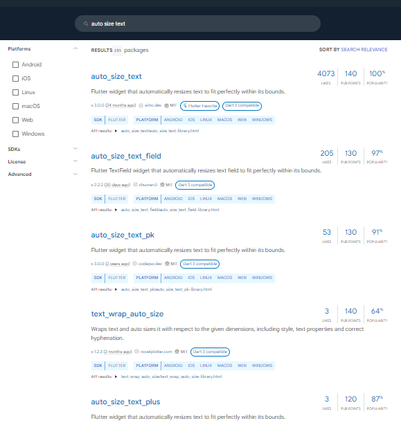
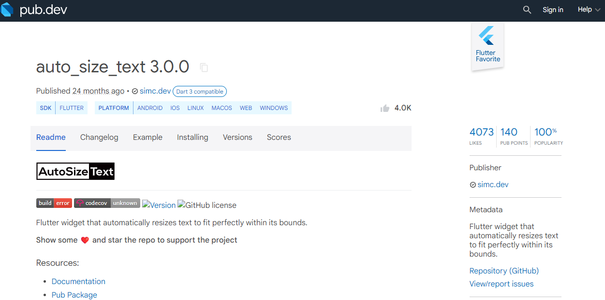
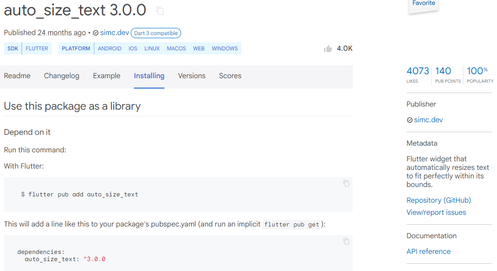
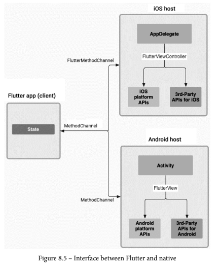
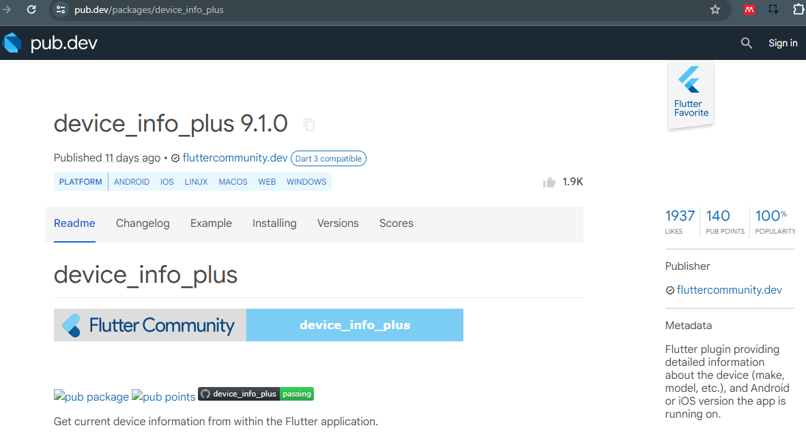
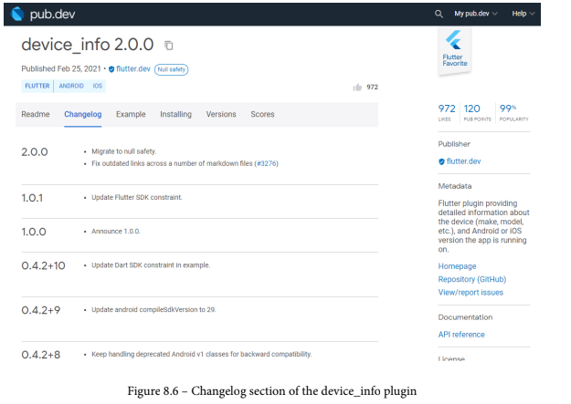
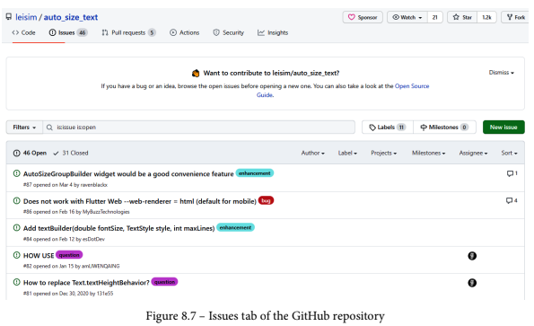

summary: Manajemen Plugin di Flutter
id: 09-manajemen-plugin
categories: Pemrograman Mobile
tags: Pemrograman Mobile
status: Published 
authors: Achmad Afiffudin Nurzein

## Manajemen Plugin di Flutter
Duration: 10 menit

Pada codelab ini, Anda akan mempelajari tentang plugin Flutter beserta contoh penggunaannya. Cara kerja, manfaat, dan cara memasang plugin ke dalam project flutter.

### Tujuan Praktikum

Setelah menyelesaikan codelab ini Anda akan mampu untuk:

*   menjelaskan manfaat plugin
*   memasang plugin ke dalam project flutter
*   memanfaatkan plugin dalam aplikasi

**Catatan:** Materi ini diadaptasi dari Buku Flutter for Beginners - second edition dan Buku Ajar Pemrograman Mobile Flutter JTI Polinema serta sumber referensi lainnya.

### Tujuan Visual
-----------------


### Sumber Daya yang Dibutuhkan

Berikut merupakan sumber daya yang diperlukan untuk menyelesaikan praktikum ini:

*   PC atau Laptop dengan spesifikasi minimum RAM 4GB Processor Core i3
*   Koneksi internet
*   Chrome Browser
*   Perangkat mobile (Android/iOS)

### Daftar Perintah

|`flutter pub add`|Untuk menambahkan plugin tertentu ke dalam project|
|-----------------|---------------------------------------------------|
|`flutter pub get`|Mengunduh semua dependensi ke dalam project (biasanya digunakan ketika pertama kali clone project dari repository) |
|`flutter pub outdated`|Untuk memeriksa pembaruan semua dependensi yang ada dalam project |
|`flutter pub update`|Untuk memperbarui semua dependensi sampai batas versi yang ditentukan dalam pubspec.yaml|

### Pengetahuan yang Anda harus Miliki

*   Algoritma dan Pemrograman Dasar
*   Pemrograman Berorientasi Objek
*   Bahasa Pemrograman Dart

## Apa itu plugin?

Banyak framework pemrograman dan software memiliki konsep plugin. Terkadang menggunakan nama lain, seperti library pihak ketiga, ekstensi, atau add-on, tetapi itu adalah hal yang sama – pengiriman kode modular mandiri yang dapat "_plugged in_" ke kode aplikasi yang ada untuk menyediakan fungsionalitas ekstra.

Dalam codelab ini, Anda akan melihat referensi ke _package_, sepotong kode Dart, dan aset. Plugin adalah jenis paket khusus yang menyediakan fungsionalitas untuk aplikasi Anda dan inilah yang akan kita bahas dalam codelab ini.

Ada banyak manfaat serta kelemahan pendekatan plugin. Jadi mari kita lihat dan pahami mengapa Flutter memilih untuk menggunakan plugin dalam kerangka kerja dan kemudian kita akan beralih pada kekurangannya.

### Keuntungan

Seperti yang Anda harapkan, Flutter menggunakan plugin karena membawa banyak manfaat. Hal ini terutama berlaku untuk _code reuse_; membuat aplikasi Flutter yang hebat akan jauh lebih sulit jika Anda harus membuat semuanya dari awal. Mari kita lihat manfaatnya.

### Code reuse

Sebagai developer, Anda akan memahami bahwa tidak ada yang ingin membuat ulang kode jika mereka dapat membantunya. Tidak hanya membuang waktu, tetapi juga dapat menimbulkan bug ketika kode yang dibuat ulang mengandung kesalahan atau tidak memperhitungkan semua aliran eksekusi berbeda yang dipertimbangkan oleh kode asli. Selain itu, kode yang dibuat ulang dapat menyebabkan sakit kepala, pemeliharaan saat perbaikan diperlukan karena Anda perlu memperbaiki kode Anda dua kali lipat.

Plugin mengatasi masalah ini dengan memecahkan masalah tertentu (misalnya, menautkan ke kalender perangkat) dan semua kode aplikasi Anda dapat mereferensikan satu plugin itu. Jika masalah ditemukan, plugin dapat diperbarui, dan semua pengguna plugin akan mendapatkan manfaat dari perbaikan tersebut.

### Many eyes

Salah satu hal hebat tentang plugin adalah karena banyak orang menggunakannya dan menemukan masalah dengannya, plugin menjadi sangat stabil dan kaya fitur.

Anda mungkin merasa bahwa dalam beberapa kasus lebih mudah hanya dengan menulis kode Anda sendiri, tetapi hampir tidak mungkin untuk menguji kode Anda pada semua perangkat yang berbeda, semua rasio layar yang berbeda, atau digunakan dengan banyak pengguna. Kode plugin diuji secara efektif dan gratis di seluruh perangkat, rasio layar, dan pola penggunaan, jadi mengapa tidak memanfaatkannya.

### Low-level integration

Untuk beberapa fungsi, Anda perlu melakukan integrasi dengan sistem operasi dasar (OS) perangkat. Ini mungkin memerlukan Java, Swift, JavaScript, atau bahasa lain yang dapat berinteraksi dengan OS, kecuali Anda mahir dalam bahasa tersebut dan juga memiliki pengetahuan tentang API yang tersedia di dalam OS, ini bisa menjadi tantangan yang cukup besar.

Plugin menangani kebutuhan itu untuk memahami integrasi tingkat rendah, sehingga Anda dapat menghabiskan waktu Anda menjadi ahli dalam Dart dan Flutter saja. Seperti yang Anda harapkan, beberapa kerugian menggunakan plugin, jadi mari kita lihat sekilas, kemudian jelajahi cara meringankannya nanti di codelab ini.

### Drawbacks

Seperti halnya keputusan perangkat lunak lain, terutama dalam skala besar seperti plugin, akan ada kekurangan yang perlu Anda pertimbangkan saat menggunakannya. Manfaatnya jauh lebih besar daripada kerugiannya, tetapi Anda tetap harus menyadarinya sehingga Anda dapat memutuskan bagaimana mengurangi dampaknya.

### Version management

Seperti sistem plugin yang bagus, semua plugin di Flutter menggunakan skema versi semantik. Ini berarti mudah untuk mengelola versi plugin mana yang Anda gunakan, dan memastikan bahwa Anda memiliki versi plugin terbaru atau terbaik (tidak selalu sama) untuk aplikasi Anda.

Namun, dengan sistem versi apa pun, ada potensi ketidakcocokan, terutama bila Anda memiliki banyak plugin yang saling bergantung. Ini dapat menyebabkan masalah, dan dalam kasus yang jarang terjadi, menghalangi Anda untuk merilis aplikasi.

### Difficult to diagnose bugs

Beberapa plugin bisa sangat rumit, dan ketika sesuatu tidak berjalan seperti yang Anda harapkan, akan sulit untuk menyelesaikan masalah. Umumnya, penulis plugin dengan senang hati membantu jika Anda menemukan masalah, tetapi terkadang masalah sulit untuk dibuat ulang, atau lebih buruk lagi, hanya terjadi pada versi rilis daripada versi debug, jadi Anda hanya memiliki informasi lama tentang masalah tersebut.

Dalam banyak hal, masalahnya bukan pada plugin yang memiliki bug, tetapi sulit untuk mendiagnosis karena Anda tidak menulis kodenya. Di sisi lain, jika Anda menulis kode, kode tersebut mungkin juga berisi bug yang sama dan Anda akan memiliki lebih banyak kode untuk dipelihara, jadi Anda mungkin tidak punya waktu untuk menemukan resolusinya.

### Breaking changes

Terkadang, pengembang plugin akan membuat perubahan besar karena mereka ingin mengubah cara kerja plugin secara mendasar, atau mereka ingin menstandardisasi plugin mereka dengan pendekatan plugin lain, atau karena salah satu dari banyak alasan lainnya.

Pengembang plugin akan membuat versi baru dari plugin dengan versi utama yang ditambahkan dan memperingatkan pengembang tentang perubahan tersebut. Anda tidak harus menggunakan versi baru plugin, tetapi pengembang kemungkinan tidak akan mempertahankan versi yang lebih lama, jadi lebih baik menggunakan versi terbaru sehingga Anda dapat menerima perbaikan bug apa pun. Ini terkadang dapat berdampak besar pada kode Anda, terutama jika Anda sangat bergantung pada plugin itu.


## Dimana mendapatkan plugin?

Flutter memiliki cara yang sangat mudah untuk menemukan plugin yang mungkin Anda perlukan melalui situs [https://pub.dev](https://pub.dev) yang mereka kelola. Di sinilah semua plugin terdaftar dan cara utama pengembang menemukan plugin.

Situs ini tidak hanya memungkinkan Anda untuk mencari plugin tetapi juga menyertakan bagian yang berguna seperti berikut ini:

*   **Flutter favorites** : Plugin yang menunjukkan tingkat kualitas tertinggi.
*   **Most populer packages** : Plugin yang paling banyak diunduh.
*   **Package of the week**: Ini adalah rangkaian video animasi yang memperkenalkan beberapa plugin yang tersedia. Flutter sangat sukses dalam menggunakan video pendek untuk memperkenalkan widget minggu ini dan telah meluncurkan konsep paket minggu ini.

Sekarang mari kita lihat bagian-bagian yang ada di pub.dev.

### Plugin entry

Salah satu contoh plugin di sini adalah widget `AutoSizeText`. Seperti namanya, widget ini akan mengubah ukuran teks yang berada didalamnya sehingga sesuai dengan batasannya.

Untuk menemukan plugin, cukup ketik "**_auto size text_**" di bilah pencarian dan hasil Anda akan terlihat seperti ini:



Hal pertama yang akan Anda perhatikan adalah ada banyak plugin yang melakukan hal serupa, jadi akan sangat sulit untuk menentukan plugin mana yang paling baik dan paling sering digunakan.

Seperti yang dapat Anda bayangkan, secara tidak sengaja menggunakan plugin yang tidak lagi dipelihara berarti perbaikan bug tidak ditindaklanjuti dan peningkatan dependensi sementara (plugin lain yang menjadi sandaran plugin ini) tidak terjadi. Selain itu, memilih plugin yang tidak digunakan orang lain berarti mungkin belum diuji secara menyeluruh seperti plugin lain yang tersedia.

Namun, pub.dev sekarang menampilkan serangkaian metrik dan informasi lainnya sehingga Anda dapat membuat pilihan yang lebih tepat. Mungkin terasa seperti terlalu fokus pada pencarian plugin, tetapi membuat pilihan yang tepat dapat membuat perbedaan besar pada proyek Anda, dan berpotensi membuat atau menghancurkannya.

Informasi utama yang dapat diambil dari halaman ini jelas adalah metrik di sebelah kanan seperti berikut:

*   **The updated date:** Apakah kode plugin masih terus diperbarui?
*   **The list of supported platforms**: Untuk `auto_size_text`, platform yang didukung adalah Android, iOS, Linux, macOS, Web, dan Windows.
*   **Version:** versi plugin yang telah dirilis, menunjukkan versi stabil dari plugin tersebut.

Jika kita mengklik **auto\_size\_text**, kita dapat melihat detail lebih lanjut tentang plugin:



Rincian informasi bagian plugin lain seperti berikut:

*   **Likes**: Seperti yang Anda harapkan, jika orang menyukai plugin, mereka dapat "menyukainya".
*   **Pub points**: Plugin dianalisis dan menetapkan poin (dari 140) pada pemeliharaan kode, dokumentasi, dukungan platform, dependensi terkini, dan sebagainya.
*   **Popularity**: Ukuran seberapa banyak aplikasi bergantung pada plugin.

Digunakan bersama-sama, ini adalah cara yang sangat ampuh untuk menilai kematangan plugin dan seberapa besar kemungkinannya untuk dipertahankan di masa depan.

Informasi berguna lainnya di halaman ini mencakup hal-hal berikut:

*   **Readme**: Di sinilah informasi tentang plugin disimpan, sering kali termasuk petunjuk instalasi dan konfigurasi proyek.
*   **Changelog**: Di sinilah Anda dapat melihat mengapa versi plugin telah ditingkatkan. Ini sangat berguna ketika Anda perlu memutakhirkan versi utama dan ingin tahu apa saja perubahan yang melanggar.
*   **Example**: Sebagian besar plugin dilengkapi dengan aplikasi contoh kecil sehingga Anda dapat melihat bagaimana plugin digunakan.
*   **Installing**: Panduan tingkat tinggi tentang cara memasang plugin ini. Umumnya, Anda tidak perlu melihat lebih dekat pada bagian ini karena semua plugin diinstal dengan cara yang sama.
*   **Repository (GitHub)**: Sebagian besar plugin dikembangkan melalui repositori GitHub dan menautkannya dari halaman ini. Jika Anda ingin melihat cara kerja plugin, maka inilah tempatnya.
*   **View/report issues:** Tautan yang sangat penting karena Anda dapat melihat masalah apa yang telah dilaporkan orang lain dan bagaimana kemajuan penyelesaiannya, dan juga mengangkat masalah Anda sendiri. Perhatikan bahwa sebagian besar pengelola plugin secara sukarela memelihara plugin mereka dan karena itu memiliki pekerjaan lain, jadi harap dipahami jika mereka tidak dapat segera menanggapi masalah apa pun.

Karena ukuran komunitas Flutter yang sangat besar, ada juga banyak tutorial video dan teks yang tersedia untuk plugin di seluruh web, pada publikasi seperti Medium dan YouTube, yang dapat memberikan panduan tambahan.

Jadi sekarang kita telah melihat cara mengakses informasi penting tentang sebuah plugin, mari kita coba menambahkan plugin `auto_size_text` ke proyek hello world kita pada bagian praktikum.

## Bagaimana cara menambahkan plugin ke project?

Menambahkan plugin ke proyek Anda umumnya sangat mudah. Namun, sangat penting bagi Anda untuk membaca readme sepenuhnya karena untuk beberapa plugin, mungkin ada konfigurasi khusus platform yang perlu Anda atur sebelum plugin dijalankan. Dalam beberapa kasus ekstrem (seperti `google_mobile_ads`), aplikasi Anda akan gagal dijalankan sepenuhnya kecuali penyiapan plugin telah diselesaikan dengan benar.

Di sini menggunakan contoh `auto_size_text` sebagai plugin yang ingin ditambahkan. Klik pada bagian **Installing** sekarang. Tangkapan layar berikut menunjukkan instruksi untuk instalasi:



Ada **dua cara** untuk menambahkan plugin ke proyek Anda, tetapi hasilnya sama.

Opsi pertama adalah menjalankan perintah flutter pada terminal seperti berikut:

```shell
    flutter pub add auto_size_text
```

Pilihan lainnya adalah mengetiknya di file `pubspec.yaml`. Lakukan langkah-langkah di bawah ini:

### File **`pubspec.yaml`**

File `pubspec.yaml` adalah tempat dependensi dan aset dikonfigurasi. Ada bagian khusus yang disebut dependensi yang menyimpan informasi tentang plugin tempat proyek Anda bergantung.

Ini akan terlihat seperti ini:

```shell
    dependencies:
      flutter:
        sdk: flutter
    
      # The following adds the Cupertino Icons font to your
      application.
      # Use with the CupertinoIcons class for iOS style icons.
      cupertino_icons: ^1.0.1
```

Indentasi sangat penting di sini dan itulah yang diandalkan oleh file **YAML** untuk memahami isinya. Perhatikan bahwa cupertino\_icons: ^1.0.1 diindentasi oleh dua spasi. Ini menunjukkan bahwa itu berada di bawah header dependensi dan karenanya merupakan dependensi proyek.

Di bawah `cupertino_icons`, tambahkan baris lain, diindentasi oleh dua spasi seperti berikut:

```shell
    auto_size_text: ^3.0.0
```

Anda sekarang telah menyatakan bahwa proyek Anda bergantung pada plugin `auto_size_text`. Jika Anda membagikan proyek Anda dengan pengembang lain, maka mereka akan langsung melihat dependensi dan dapat memperbarui proyek yang sesuai.

Anda juga telah menentukan versi plugin menggunakan versi semantik plugin. Ini mengunci aplikasi Anda ke versi plugin tertentu, memungkinkan Anda untuk menguji dan melepaskan tanpa perubahan dependensi. Anda mungkin melihat karakter ^ sebelum nomor versi. Ini menentukan bahwa Anda senang menerima pembaruan versi tambalan apa pun ke plugin.

Misalnya, jika Anda menentukan versi `2.1.0`, maka hanya versi `2.1.0` yang akan digunakan oleh Anda dan pengembang lain yang menggunakan kode sumber ini. Jika Anda menentukan versi `^2.1.0`, maka versi `2.1.x` mana pun yang `x >= 0` dapat digunakan. Ini berarti Anda akan secara otomatis menerima pembaruan (saat Anda mengunduh plugin). Ada risiko bahwa Anda mungkin memiliki versi plugin yang sedikit berbeda dengan rekan kerja Anda, tetapi hanya akan ada perbedaan di tingkat _patch_.

Plugin tersebut statusnya belum diunduh dan belum tersedia untuk proyek Anda. Untuk melakukan ini, kita akan menggunakan perintah yang sangat berguna yang disebut `flutter pub`, yang digunakan untuk mengelola plugin.

### flutter pub

Di dalam perintah `flutter`, ada perintah `pub` yang khusus digunakan untuk manajemen plugin. Ada beberapa cara Anda dapat menggunakannya, jadi perhatikan beberapa yang paling sering digunakan.

#### **flutter pub get**

Perintah `flutter pub get` akan membaca semua dependensi di `pubspec`.`yaml`, ambil plugin yang relevan dari `pub.dev`, dan unduh ke komputer Anda, sehingga plugin tersebut siap digunakan untuk proyek Anda.

Kita perlu menggunakan perintah berikut untuk mengunduh plugin `auto_size_text` yang bergantung pada proyek kita:

```shell
    PS C:\Flutter\hello_world> flutter pub get
    Running "flutter pub get" in hello_world... 2,142ms
```

Kadang-kadang, `flutter pub get` akan gagal karena dependensi yang tidak konsisten dan kita akan melihat cara mengatasinya di bagian _Common issues_ nanti di codelab ini.

Pada titik ini, dependensi plugin telah dideklarasikan dan diunduh ke komputer Anda.

Anda siap untuk mengembangkan aplikasi, tetapi mari kita lihat beberapa perintah `flutter pub` berguna lainnya.

#### **flutter pub outdated**

Perintah ini akan memeriksa apakah ada dependencies yang memiliki versi lebih baru yang mungkin ingin ditingkatkan. Menjalankan perintah ini akan memberi output seperti berikut:

```shell
    PS C:\Flutter\hello_world> flutter pub outdated
    Showing outdated packages.
    [*] indicates versions that are not the latest available.
    
    Package Name Current Upgradable Resolvable Latest
    
    direct dependencies: all up-to-date.
    
    transitive dev_dependencies:
    crypto  *3.0.0  *3.0.0  *3.0.0  3.0.1
    
    vm_service *6.1.0+1 *6.1.0+1 *6.1.0+1 6.2.0
    You are already using the newest resolvable versions listed in
    the 'Resolvable' column.
    Newer versions, listed in 'Latest', may not be mutually
    compatible.
```

Meskipun ini terlihat cukup menakutkan, bagian penting yang perlu diperhatikan adalah bahwa dependencies langsung Anda semuanya mutakhir, jadi Anda tidak perlu melakukan apa-apa lagi.

Jika perintah tersebut menunjukkan bahwa ada dependencies yang lebih baru, maka Anda harus terlebih dahulu memahami apa perubahannya, dengan membuka `pub.dev` dan membaca **changelog**. Kemudian, Anda dapat memperbarui `pubspec.yaml` untuk menentukan versi baru, dan akhirnya menjalankan `flutter pub get` untuk mengunduh versi terbaru ke komputer Anda.

#### **flutter pub upgrade**

Disebutkan sebelumnya bahwa versi dapat menyertakan simbol `^` untuk menentukan bahwa Anda senang menerima pembaruan (_update_).

Pembaruan patch ini tidak muncul secara ajaib di komputer Anda; Anda masih perlu memberi tahu Flutter untuk mengambil/mengunduh pembaruan. Anda dapat melakukan ini dengan perintah `flutter pub update`. Ini mirip seperti `flutter pub get`, tetapi Anda memberikannya izin untuk mendapatkan plugin terbaru dalam batasan versi yang ditentukan di `pubspec.yaml`.

Jadi sekarang Anda telah memahami lebih banyak tentang manajemen plugin di Flutter.

## Bagaimana plugin bekerja pada iOS dan Android ?

Banyak plugin akan bekerja dengan platform dasar yang berbeda untuk menggunakan fungsionalitas sistem operasi. Dependensi ini mengubah cara proyek Anda dibangun dan dijalankan karena ada kode asli dalam proyek Anda yang berinteraksi dengan platform yang mendasarinya. Mari kita lihat bagaimana antarmuka itu bekerja.

### MethodChannel

Komunikasi Flutter antara klien (Flutter) dan aplikasi host (native) terjadi melalui saluran platform. Kelas `MethodChannel` bertanggung jawab untuk mengirim pesan (method invocations) ke sisi platform. Di sisi platform, `MethodChannel` di Android (API) dan `FlutterMethodChannel` di iOS (API) memungkinkan menerima panggilan metode dan mengirim kembali hasilnya. Struktur hubungan ini ditunjukkan dalam diagram berikut.



Teknik channel platform memungkinkan pemisahan kode UI dari kode asli khusus platform. Host akan mendengarkan di saluran platform dan menerima permintaan pesan. Itu bisa menggunakan API platform untuk memberlakukan permintaan dan kemudian mengirim kembali respons ke klien, bagian Flutter dari aplikasi.

Dengan cara ini, bagian Flutter dari aplikasi bersifat agnostik terhadap host yang memungkinkan Anda menulis kode yang akan berfungsi di semua platform.

Memiliki pemahaman dasar tentang plugin ini akan memungkinkan Anda mendiagnosis masalah dengan lebih baik dan menilai kesesuaian plugin untuk aplikasi Anda.

Mari kita jelajahi sedikit lebih jauh dengan menambahkan plugin ke proyek kita yang menggunakan kode asli. Contoh plugin tersebut adalah plugin `device_info_plus`. Ini mengambil informasi tentang perangkat Anda dari platform yang mendasarinya, seperti model dan nama perangkat.



Jadi, tambahkan `device_info` terbaru ke file `pubspec.yaml` Anda menggunakan perintah berikut:

```shell
    flutter pub add device_info_plus
```

Jika Anda ingin informasi lebih lanjut tentang plugin, kunjungi situs `pub.dev` dan cari `device_info_plus`.

Lihatlah file `pubspec.yaml` dan Anda akan melihat bahwa plugin `device_info_plus` telah ditambahkan di dalam bagian `dependencies`. Selain itu, `flutter pub get` secara otomatis dijalankan untuk menarik kode Flutter ke dalam proyek Anda. Namun, Anda belum memiliki kode native yang tersedia.

Jika Anda menjalankan (atau build) proyek, Flutter akan secara otomatis mengambil `dependencies` kode native. Ini dikelola oleh **CocoaPods** di iOS dan **Gradle** di Android.

### CocoaPods

Untuk library kode native iOS, Flutter menggunakan CocoaPods dependency manager. Plugin Flutter yang memerlukan kode native iOS akan menentukan dependensi pada pustaka CocoaPods dan pengelola dependensi CocoaPods akan mengunduh pustaka yang relevan pada versi yang benar dan memasukkannya ke dalam versi iOS Anda.

Setelah Anda menjalankan proyek Anda di emulator atau perangkat iOS, Anda mungkin memperhatikan bahwa ada file yang muncul di dalam folder iOS di dalam file proyek Anda. Ini disebut PodFile dan memanage dependency CocoaPods Anda.

Saat Anda menjalankan atau membangun proyek Anda, manajer dependensi CocoaPods dipanggil dengan memanggil perintah pod `install` di dalam folder `ios`. Semua dependency diambil pada versi yang sesuai untuk proyek Anda.

Terkadang plugin akan meminta Anda untuk mengelola izin aplikasi Anda. Ini dapat dilakukan di file `ios/Runner/Info.plist.`

Bagian dari proses build ini sering kali dapat menyebabkan masalah saat Anda mengubah dependency Anda, jadi di bagian _Common issues_ di codelab ini, kita akan mengeksplorasi beberapa solusi.

### Gradle

Membangun dan menjalankan aplikasi Flutter di Android menggunakan alat otomatisasi pembangunan Gradle. Anda dapat menjelajahi beberapa file di folder `android`, tetapi file yang terkadang perlu Anda ubah untuk mengonfigurasi plugin adalah sebagai berikut:

*   `android/build.gradle`
*   `android/app/build.gradle`

File-file ini mengelola proses build dan dependensi yang dibutuhkan dalam proyek Anda, dan terkadang beberapa manipulasi versi atau alur build diperlukan agar plugin berfungsi dengan benar.

Selain itu, seperti iOS, beberapa plugin akan memerlukan pembaruan untuk izin aplikasi. Ini dapat dilakukan di file `android/app/src/main/AndroidManifest.xml.`

Sekarang Anda memiliki pengetahuan dasar tentang proses plugin, mari kita lihat beberapa masalah umum yang mungkin Anda temui dan bagaimana mengatasinya di bagian selanjutnya.


## Isu yang sering terjadi
Terkadang Flutter run atau build Anda akan gagal, dan seringkali ini terkait dengan masalah plugin. Di bagian ini, kita akan melihat beberapa masalah umum dan memberikan beberapa petunjuk tentang cara mengatasinya.

### Plugin breaking change

Ketika sebuah plugin mengubah nomor versi mayor atau minornya, itu bisa berarti bahwa telah terjadi perubahan yang mengganggu dan Anda perlu membuat beberapa perubahan agar plugin tetap berfungsi dengan benar.

Umumnya ada dua alasan melakukan perubahan:

*   Melalui perubahan/pembaruan merupakan cara untuk menggunakan plugin pada tingkat pemrograman. Misalnya, parameter konstruktor untuk widget telah berubah, atau aliran pemanggilan metode ke plugin perlu dimodifikasi. Ini sering hanya diberitahukan melalui kesalahan kompilasi dan peringatan break point.
*   Perubahan yang diperlukan dalam konfigurasi proyek Anda. Ini bisa jadi kurang jelas dan memeriksa plugin readme di pub.dev seringkali merupakan cara terbaik untuk menilai apakah Anda perlu mengubah konfigurasi proyek Anda.

Di halaman `pub.dev`, ada bagian khusus yang didedikasikan untuk menjelaskan mengapa perubahan versi terjadi yang disebut **Changelog**:



Di bagian ini, pengembang plugin akan sering menampilkan berbagai jenis pembaruan yang terjadi pada setiap kenaikan versi, termasuk perubahan yang signifikan, sehingga pengembang aplikasi dapat dengan mudah melihat perubahan apa yang perlu mereka buat.

Selain itu, pengembang plugin terkadang membuat kesalahan ketika merilis update. Pengembang plugin sering meluangkan waktu mereka secara sukarela untuk mengembangkan plugin, sehingga dapat membuat kesalahan karena kurangnya waktu atau pengalaman. Sekali lagi, ada baiknya memeriksa readme dan changelog di pub.dev jika Anda mengalami masalah, hanya untuk memeriksa tidak ada perubahan yang merusak aplikasi.

### Plugin not working

Akan ada saat-saat ketika Anda yakin bahwa sebuah plugin tidak berfungsi seperti yang Anda harapkan. Ada cara mudah untuk melaporkan masalah melalui tautan **View/report issues** di halaman `pub.dev` untuk plugin. Umumnya, tautan ini akan membawa Anda ke tab Issues dari repositori GitHub plugin tempat Anda dapat memeriksa apakah masalah telah disampaikan dan apakah perbaikan sedang berlangsung:



Perlu dicatat bahwa karena plugin umumnya dibuat oleh komunitas, sering kali ada pengembang lain yang mencoba memperbaiki plugin dan membagikan pull request (PR) dengan pengembang plugin untuk membantu mereka. Saat Anda yakin dengan Flutter, jangan ragu untuk mencoba membantu pengembang plugin jika Anda mengidentifikasi masalah dan merasa tahu solusinya.

### PR not merged

Terkadang Anda akan melihat masalah dengan plugin yang telah diperbaiki oleh seseorang di komunitas dan mereka telah mengeluarkan PR yang belum digabungkan ke dalam cabang kode master plugin. Ini sering terjadi dengan plugin yang kurang populer di mana jumlah kontributornya rendah, dan kontributor utama mungkin telah pindah dari plugin.

Namun, bahkan tanpa PR merged, Anda masih dapat menggunakannya dalam proyek Anda sebagai dependensi. Ini bisa sangat berguna jika Anda memerlukan perbaikan, dan pengembang telah memperbaikinya tetapi belum di-_merge_. Terkadang, Anda tidak bisa menunggu _merger_ itu terjadi karena masalah rilis aplikasi Anda berikutnya.

Oleh karena itu, untuk memanfaatkan PR sebelum di _merge_, tambahkan bagian baru ke `pubspec.yaml` Anda yang disebut `dependency_overrides` dan tambahkan tautan ke entri git. Berikut adalah contoh plugin `device_calendar` yang diperlukan saat Flutter pindah ke keamanan nol dan PR plugin `device_calendar` untuk keamanan nol belum digabungkan ke cabang master plugin:

```shell
    dependency_overrides:
      device_calendar:
        git:
          url: https://github.com/thomassth/device_calendar_null.git
```

Seperti yang Anda lihat, Anda menentukan nama plugin dan kemudian lokasi repositori override.

### Inconsistent dependencies

Seperti halnya sistem manajemen dependensi, ada kalanya satu plugin bergantung pada dependensi tertentu yang berbenturan dengan versi plugin lain.

Seringkali resolusinya adalah memastikan bahwa semua plugin Anda dalam versi terbaru.

Namun, jika ini tidak menyelesaikan masalah, maka Anda mungkin perlu mengangkat masalah dengan pengembang plugin, dan kemudian kembali ke versi plugin yang lebih lama.

Anda mungkin juga mengalami masalah ini saat menjalankan build di iOS. Dependensi CocoaPods terkadang berbenturan secara tak terduga. Anda sering dapat mengatasi ini dengan merapikan repository CocoaPods Anda secara manual.

Jika Anda membuka terminal di folder ios proyek Anda, ada beberapa perintah yang dapat Anda coba untuk membersihkan data. Yang pertama adalah menjalankan instalasi pod secara manual dan melihat pesan kesalahan apa yang Anda dapatkan:

```shell
    pod install
```

Anda dapat mencoba menghapus direktori ios/Pods (semua dependensi yang diunduh) dan file Podfile.lock dan kemudian menjalankan ulang pod install pada direktori baru.

Selain itu, terkadang Anda perlu memperbarui repositori CocoaPods. Ini mencantumkan semua pod dan versi perpustakaan yang tersedia untuk CocoaPods dan dapat menjadi usang.

Untuk melakukannya, jalankan perintah berikut:

```shell
    pod repo update
```

Jika tidak satu pun dari solusi tersebut belum menyelesaikan masalah, maka dilaporkan pada Issue di GitHub yang mungkin menjadi jawaban Anda.

### MissingPluginException

Ada banyak masalah lain, termasuk `MissingPluginException` yang terkenal, yang sering diselesaikan dengan sedikit pembersihan folder Flutter.

Membersihkannya cukup mudah. Pertama, jalankan perintah berikut:

```shell
    flutter clean
```

Ini akan membersihkan dependensi dan membangun folder.

Kemudian jalankan perintah berikut:

```shell
    flutter pub get
```

Ini akan mengambil semua dependensi lagi.

Ada banyak kesalahan lain yang bisa Anda dapatkan, yang sebagian besar telah dialami orang berkali-kali dan pencarian solusi di internet sering menemukan jawabannya, seperti **StackOverflow** menjadi sumber yang bagus untuk mendapatkan solusi.

## Praktik Menerapkan Plugin di Project Flutter

Selesaikan langkah-langkah praktikum berikut ini menggunakan editor Visual Studio Code (VS Code) atau Android Studio atau code editor lain kesukaan Anda.

**Perhatian:** Diasumsikan Anda telah berhasil melakukan setup environment Flutter SDK, VS Code, Flutter Plugin, dan Android SDK pada pertemuan pertama.

### Langkah 1: Buat Project Baru

Buatlah sebuah project flutter baru dengan nama **flutter\_plugin\_pubdev**. Lalu jadikan repository di GitHub Anda dengan nama **flutter\_plugin\_pubdev.**

### Langkah 2: Menambahkan Plugin

Tambahkan plugin `auto_size_text` menggunakan perintah berikut di terminal

```shell
    flutter pub add auto_size_text
```

Jika berhasil, maka akan tampil nama plugin beserta versinya di file `pubspec.yaml` pada bagian dependencies.

### Langkah 3: Buat file **`red_text_widget.dart`

Buat file baru bernama `red_text_widget.dart` di dalam folder lib lalu isi kode seperti berikut.

```dart
    import 'package:flutter/material.dart';
    
    class RedTextWidget extends StatelessWidget {
      const RedTextWidget({Key? key}) : super(key: key);
    
      @override
      Widget build(BuildContext context) {
        return Container();
      }
    }
```

### Langkah 4: Tambah Widget AutoSizeText

Masih di file `red_text_widget.dart`, untuk menggunakan plugin `auto_size_text`, ubahlah kode `return Container()` menjadi seperti berikut.

```dart
    return AutoSizeText(
          text,
          style: const TextStyle(color: Colors.red, fontSize: 14),
          maxLines: 2,
          overflow: TextOverflow.ellipsis,
    );
```

Setelah Anda menambahkan kode di atas, Anda akan mendapatkan info error. Mengapa demikian? Jelaskan dalam laporan praktikum Anda!

### Langkah 5: Buat Variabel text dan parameter di constructor

Tambahkan variabel `text` dan parameter di constructor seperti berikut.

```dart
    final String text;
    
    const RedTextWidget({Key? key, required this.text}) : super(key: key);
```

### Langkah 6: Tambahkan widget di main.dart

Buka file `main.dart` lalu tambahkan di dalam `children:` pada `class _MyHomePageState`

```dart
    Container(
       color: Colors.yellowAccent,
       width: 50,
       child: const RedTextWidget(
                 text: 'You have pushed the button this many times:',
              ),
    ),
    Container(
        color: Colors.greenAccent,
        width: 100,
        child: const Text(
               'You have pushed the button this many times:',
              ),
    ),
```

**Run** aplikasi tersebut dengan tekan **F5**, maka hasilnya akan seperti berikut.


<!--
1.  Selesaikan Praktikum tersebut, lalu dokumentasikan dan push ke repository Anda berupa screenshot hasil pekerjaan beserta penjelasannya di file `README.md`!
2.  Jelaskan maksud dari langkah 2 pada praktikum tersebut!
3.  Jelaskan maksud dari langkah 5 pada praktikum tersebut!
4.  Pada langkah 6 terdapat dua widget yang ditambahkan, jelaskan fungsi dan perbedaannya!
5.  Jelaskan maksud dari tiap parameter yang ada di dalam plugin `auto_size_text` berdasarkan tautan pada dokumentasi [ini](https://pub.dev/documentation/auto_size_text/latest/) !
6.  Kumpulkan laporan praktikum Anda berupa link repository GitHub ke spreadsheet yang telah disediakan!

7.  Tambahkan plugin untuk fungsi kamera pada aplikasi OCR kelompok Anda. Misalnya menggunakan plugin ini [https://pub.dev/packages/camera](https://pub.dev/packages/camera) (silakan boleh gunakan plugin lain)
8.  Tambahkan plugin animasi loading dan transisi pada aplikasi OCR kelompok Anda.
9.  Jika telah berhasil sesuai kebutuhan, maka push hasil kontribusi masing-masing anggota kelompok ke repository project PBL.

Selamat Anda telah menyelesaikan Codelab ini. Anda telah mempelajari terkait plugin di pub.dev dan contoh penggunaannya.

Pada codelab berikutnya, Anda akan mempelajari tentang Dasar _State Management_.

<!-- 
**Apa selanjutnya?**
--------------------

Silakan cek beberapa sumber belajar lainnya...

*   [https://pub.dev/documentation/auto\_size\_text/latest/](https://pub.dev/documentation/auto_size_text/latest/)
*   [Flutter System Architecture](https://docs.google.com/presentation/d/1cw7A4HbvM_Abv320rVgPVGiUP2msVs7tfGbkgdrTy0I/edit#slide=id.p)

**Referensi**
-------------

*   [Flutter for Beginners Second Edition](https://drive.google.com/file/d/1hJbctx-_O3B6kUeG70bJD5xfbnsWwBXY/view?usp=sharing)
*   [https://www.youtube.com/flutterdev](https://www.youtube.com/flutterdev)
*   [https://github.com/PacktPublishing/Flutter-for-Beginners-Second-Edition](https://github.com/PacktPublishing/Flutter-for-Beginners-Second-Edition)
*   Buku Ajar Pemrograman Mobile Dengan Flutter, Jurusan Teknologi Informasi, Politeknik Negeri Malang. 2021. -->